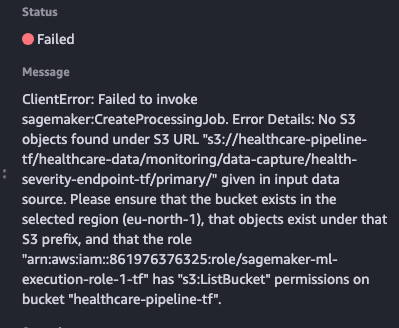
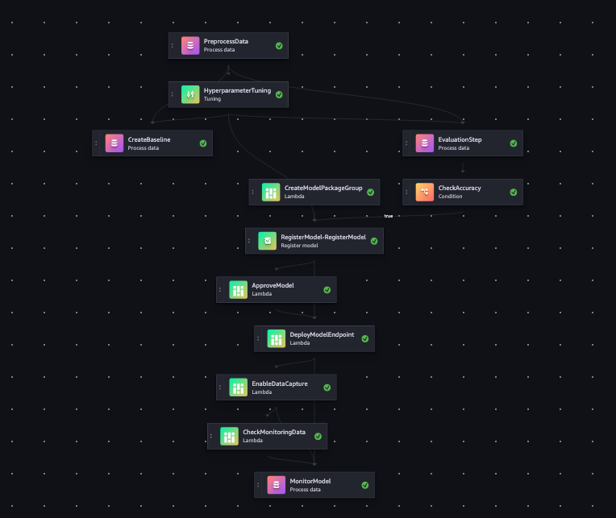
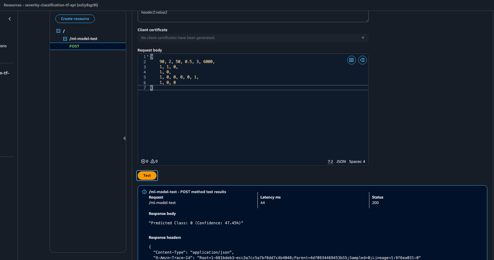
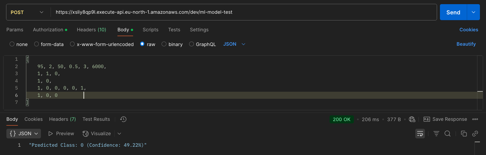

# healthcare-severity-classification-model
This machine learning model will predict severity of illness 

## Usage

```
cd healthcare-severity-classification-model/terraform
terraform init
terraform plan
terraform apply
```

## Important notes about Model Monotoring step

When you execute pipeline first time, pipeline will fail in "MonitorModel" step becuase it does not have any real inference data.
you might get following error.



Or

```

ERROR:__main__:Monitoring failed: Insufficient valid data: 4 records (need at least 10)
```

In order to fix it you need to execute below script multiple times so that it has some data to Monitor. Minimum 10 records.
You can change sample_input to any random data. For example, change Age, type of Admission etc multiple times.

## Amazon SageMaker pipeline after executing successfully



## Sample Boto3 script for real inference to Model
```python
import boto3

client = boto3.client('sagemaker-runtime', region_name='eu-north-1')

sample_input = [
    45, 2, 50, 0.5, 3, 6000,  // (Age,num_health_conditions,Admission_Days,Department_encoded,Visitors with Patient,Admission_Deposit) (Original numeric features
    1, 0, 0,                  // Type of Admission (Emergency, Trauma, Urgent ) (one-hot encoded)
    0, 1,                      // Insurance (Yes/No)
    1, 0, 0, 0, 0, 1,          // Ward Facility Code (A,B,C,D,E,F) (one-hot encoded)
    1, 0, 0                    // Gender (Male, Femail, Other)(one-hot encoded)
]

# Convert list to CSV string
csv_input = ",".join(map(str, sample_input))
print(csv_input)

response = client.invoke_endpoint(
    EndpointName='health-severity-endpoint-tf',
    ContentType='text/csv', 
    Body=csv_input
)

result = response['Body'].read().decode('utf-8')
print(result)
```

## Model Prediction

[ <br/>
    45, 2, 50, 0.5, 3, 6000,  // (Age,num_health_conditions,Admission_Days,Department_encoded,Visitors with Patient,Admission_Deposit) (Original numeric features <br/>
    1, 0, 0,                  // Type of Admission (Emergency, Trauma, Urgent ) (one-hot encoded) <br/>
    0, 1,                      // Insurance (Yes/No) <br/>
    1, 0, 0, 0, 0, 1,          // Ward Facility Code (A,B,C,D,E,F) (one-hot encoded) <br/>
    1, 0, 0                    // Gender (Male, Femail, Other)(one-hot encoded) <br/>
] <br/>

You can pass this sample input in API Gateway console or in Postman.






## Terraform destroy

Before you destroy, please manually delete EFS file system which was automatically provisioned when we create SageMaker Domain. We are not managing it via Terraform. Delete mount tagets, security groups etc.

```
terraform destroy
```


